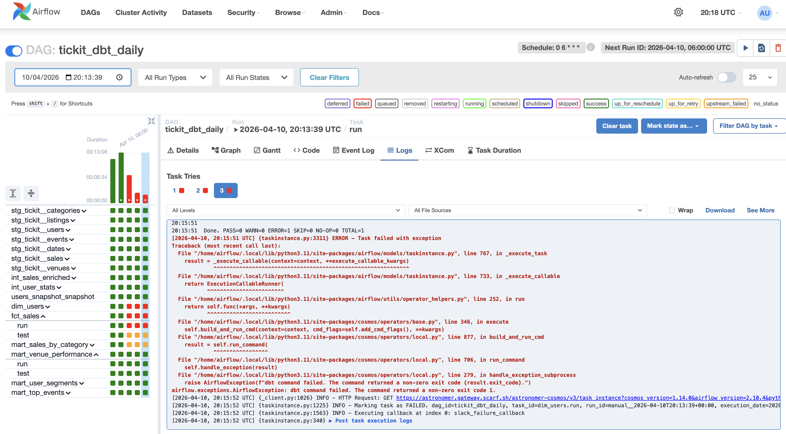
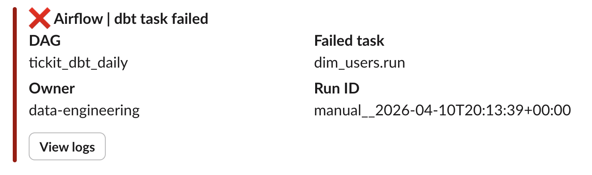
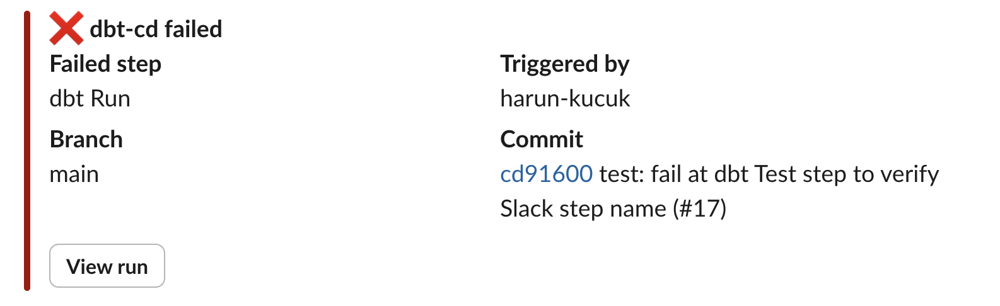

# dbt Redshift Analytics

A portfolio analytics project using **dbt**, **AWS Redshift Serverless**, **Terraform**, and **Apache Airflow**. Transforms the Redshift TICKIT sample dataset through a layered data model into analytics-ready tables, orchestrated with Cosmos DAGs.

## Stack

| Tool | Purpose |
|---|---|
| AWS Redshift Serverless | Cloud data warehouse (8 RPU, eu-west-2) |
| dbt-redshift 1.10 | Data transformation |
| dbt_utils 1.x | Surrogate key generation (`generate_surrogate_key`) |
| Terraform | Infrastructure as code |
| Apache Airflow 2.10 + Cosmos 1.14 | Pipeline orchestration |
| SQLFluff | SQL linting (jinja templater, ansi dialect) |
| S3 | Terraform remote state |
| GitHub Actions | CI/CD for dbt and Terraform |

## Architecture

```
sample_data_dev.tickit  (Redshift built-in sample)
        │
        ▼
┌─────────────────────────────┐
│  staging_tickit  (views)    │  Rename & cast — no logic
│  stg_tickit__*              │  Late-binding (bind: false)
└─────────────────────────────┘
        │
        ▼
┌─────────────────────────────┐
│  intermediate  (tables)     │  Joins, business logic, aggregations
│  int_*                      │
└─────────────────────────────┘
        │
        ▼
┌─────────────────────────────┐
│  marts  (tables)            │  Analytics-ready: facts, dims, aggregates
│  fct_*  dim_*  mart_*       │  Contracts enforced on fct_sales, dim_users
└─────────────────────────────┘
        │
        ▼
┌─────────────────────────────┐
│  Airflow + Cosmos           │  Scheduled orchestration (06:00 UTC daily)
│  tickit_dbt_daily           │  Each dbt model = individual Airflow task
│  Slack failure alerts       │  On-failure webhook notification
└─────────────────────────────┘
```

## dbt Models

### Staging (`staging_tickit`)
| Model | Description |
|---|---|
| `stg_tickit__sales` | Ticket sale transactions |
| `stg_tickit__users` | Buyers and sellers with preferences |
| `stg_tickit__events` | Events (concerts, sports, shows) |
| `stg_tickit__venues` | Venue details |
| `stg_tickit__listings` | Active ticket listings |
| `stg_tickit__categories` | Event categories |
| `stg_tickit__dates` | Date dimension |

### Intermediate (`intermediate`)
| Model | Description |
|---|---|
| `int_sales_enriched` | Sales joined with all dimensions; includes `net_revenue`, `commission_rate` |
| `int_user_stats` | Per-user aggregated purchase, sales, and listing metrics |

### Marts (`marts`)
| Model | Type | Notes |
|---|---|---|
| `fct_sales` | Fact | Incremental (1-day overlap), contract enforced, surrogate key via `dbt_utils` |
| `dim_users` | Dimension | Users with lifetime metrics, contract enforced |
| `mart_sales_by_category` | Aggregate | Revenue rollup by category and year |
| `mart_top_events` | Aggregate | Events ranked by revenue with revenue-per-ticket |
| `mart_venue_performance` | Aggregate | Venue revenue and seat fill rate |
| `mart_user_segments` | Aggregate | Buyer, seller, and interest segments |

### Snapshots (`snapshots`)
| Snapshot | Strategy | Description |
|---|---|---|
| `users_snapshot` | `check` (all columns) | SCD Type 2 — tracks changes to user preferences over time |

## Airflow DAGs

| DAG | Schedule | Description |
|---|---|---|
| `tickit_dbt_daily` | 06:00 UTC | Full pipeline |
| `tickit_dbt_staging` | Manual | Staging layer only |
| `tickit_dbt_intermediate` | Manual | Intermediate layer only |
| `tickit_dbt_marts` | Manual | Marts layer only |
| `tickit_dbt_adhoc` | Manual | Free-form `command` + `selector` trigger |

All DAGs send a Slack alert on failure via `SLACK_WEBHOOK_URL` env var (gracefully skipped if not set).





## CI/CD

| Workflow | Trigger | Actions |
|---|---|---|
| `dbt-ci` | PR touching `dbt/**` | SQLFluff lint → `dbt run` + `dbt test` on `dev` with PR-isolated schemas |
| `dbt-cd` | Merge to `main` on `dbt/**` | `dbt run` + `dbt test` on `analytics` (prod) |
| `terraform-ci` | PR touching `terraform/**` | `terraform plan`, posts plan as PR comment |
| `terraform-cd` | Merge to `main` on `terraform/**` | `terraform apply` |
| `pr-cleanup` | PR closed | Drops `pr_<N>_*` schemas from dev DB |

`dbt-cd` and `terraform-cd` post a Slack alert on failure showing the failed step, branch, commit, and a direct link to the run.



## Infrastructure

Managed by Terraform in `terraform/`. Schemas defined in `terraform/schemas.csv`.

```
AWS
├── Redshift Serverless
│   ├── Namespace: analytics
│   └── Workgroup: analytics (8 RPU, eu-west-2)
├── Security Group: port 5439
└── S3: terraform remote state
```

See [ADR 003](docs/decisions/003-redshift-serverless-over-provisioned.md) for why Serverless was chosen over a provisioned cluster.

## Getting Started

### 1. Deploy Infrastructure

```bash
cd terraform
export TF_VAR_admin_password="<password>"
terraform init
terraform apply
```

### 2. Configure dbt

Add `~/.dbt/profiles.yml` with Redshift credentials (not committed — see `dbt/profiles.yml` for CI template).

### 3. Run dbt

```bash
make deps    # install dbt packages
make build   # dbt run + dbt test
make docs    # generate and serve lineage docs
```

### 4. Start Airflow

```bash
cd airflow
cp .env.example .env       # fill in DBT_PASSWORD and optionally SLACK_WEBHOOK_URL
cd ..
make compile               # generate manifest.json (required by Cosmos)
make airflow-init          # one-time DB migrate + user creation
make airflow-up            # start webserver + scheduler
# open http://localhost:8080  (admin / admin)
```

### 5. Lint SQL

```bash
make lint        # check all models, macros, and tests
make lint-fix    # auto-correct where possible
```

## Project Structure

```
├── dbt/
│   ├── models/
│   │   ├── staging/         stg_tickit__* late-binding views
│   │   ├── intermediate/    int_* joined & enriched tables
│   │   └── marts/           fct_* dim_* mart_* analytics tables
│   ├── macros/              safe_divide, test_is_positive, generate_schema_name
│   ├── snapshots/           users_snapshot (SCD Type 2)
│   ├── packages.yml         dbt_utils dependency
│   ├── tests/               singular SQL tests
│   └── dbt_project.yml
├── airflow/
│   ├── dags/                tickit_dbt_*.py cosmos DAGs
│   ├── dags/common.py       shared config + Slack failure callback
│   ├── Dockerfile
│   ├── docker-compose.yml
│   └── requirements.txt
├── terraform/
│   ├── main.tf              Redshift + security group
│   ├── schemas.tf           schema provisioning from CSV
│   ├── schemas.csv          schema source of truth
│   └── versions.tf          S3 backend + provider pins
├── docs/
│   ├── decisions/           ADR 001–003
│   └── runbook.md           operational on-call reference
├── .github/workflows/       dbt-ci, dbt-cd, terraform-ci, terraform-cd, pr-cleanup
├── .sqlfluff                SQLFluff config (jinja templater, ansi dialect)
├── .claude/rules/           layer-specific coding rules for Claude Code
├── Makefile                 single entrypoint for all developer operations
└── CLAUDE.md                project guide
```

## Architecture Decision Records

| ADR | Decision |
|---|---|
| [001](docs/decisions/001-late-binding-views-for-staging.md) | Late-binding views for staging layer |
| [002](docs/decisions/002-cosmos-over-bash-operator.md) | Astronomer Cosmos over BashOperator for dbt orchestration |
| [003](docs/decisions/003-redshift-serverless-over-provisioned.md) | Redshift Serverless over provisioned cluster |

## Runbook

See [docs/runbook.md](docs/runbook.md) for:
- Daily DAG failure diagnosis and re-trigger steps
- Backfilling instructions (including `fct_sales` full-refresh)
- Adding new staging, intermediate, and mart models
- Schema change procedures
- Redshift connection troubleshooting
- Useful diagnostic queries
